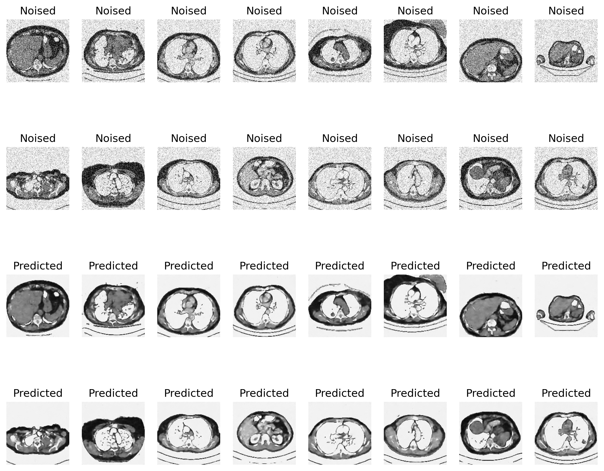

# 🧼 Image Denoising using Convolutional Autoencoders

This project implements a **Convolutional Autoencoder** in Python using TensorFlow/Keras to effectively remove noise from grayscale images and reconstruct high-quality images.

---

## 📌 Project Overview
- **Architecture:** Convolutional Autoencoder (Encoder-Decoder framework)
- **Input Dimensions:** 160x160x1 (Grayscale)
- **Optimizer:** Adam
- **Loss Function:** Binary Crossentropy

---

## 📊 Evaluation & Metrics
The model performance was evaluated on the test set using standard reconstruction metrics:
- **Mean Squared Error (MSE):** `[0.007662247400730848]`
- **Peak Signal-to-Noise Ratio (PSNR):** `[20.711244075378538]` dB

---

## 🖼️ Results
Below is a comparison between the noised input images and the reconstructed clean predictions:

---

## 🛠️ Tech Stack
- **Framework:** TensorFlow / Keras
- **Libraries:** NumPy, Matplotlib, OpenCV, scikit-image
